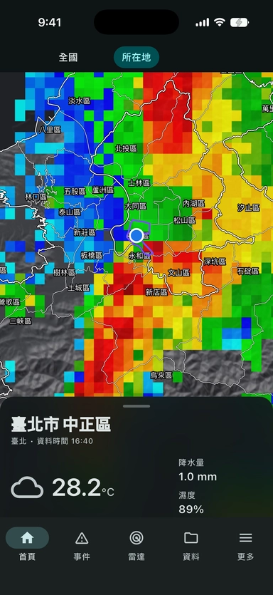

# 115-B
## 115-B
### 115-B
#### 115-B
##### 115-B
###### 115-B
`小區塊`的說
```
大大大區塊的說
```
>每次都想裝作很倔強
>但是見面自己卻繳械投降
>>因為愛你
>>因為愛你
>>因為愛你
>>>我有死亡回歸
>>>>好ㄟ 我心臟爆掉了

*   Red
*   Green
*   Blue
或
+   Red
+   Green
+   Blue
或
-   Red
-   Green
-   Blue

1.  沒差
2.  有差嗎
3.  沒差吧

***
***
# `彪哥`
***
***
```[Arras](https://arras.io/#cc)
(https://arras.io/#cc)
```
| Left-Aligned  | Center Aligned  | Right Aligned |
| :------------ |:---------------:| -----:|
| col 3 is      | some wordy text | $1600 |
| col 2 is      | centered        |   $12 |
| zebra stripes | are neat        |    $1 |
| test | 測試        |    $3333 |
```ruby
def index
puts "hello world"
end
```
**哈囉**

*你好嗎*

~~衷心感謝~~


[](https://youtu.be/u0BpB3uJ3tQ?si=vhtvRUKyH1CeCe_U")
